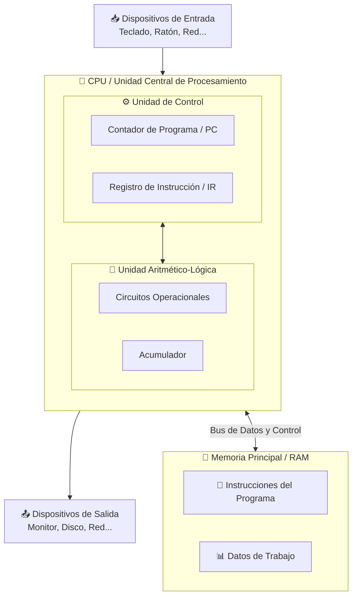
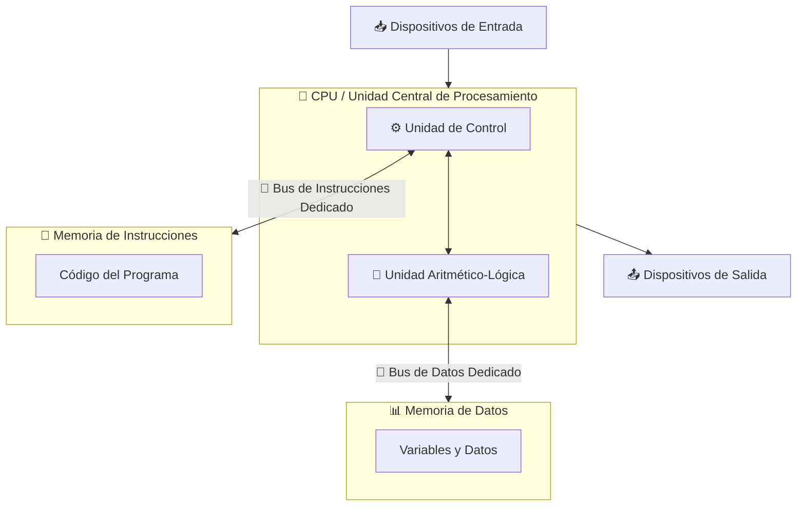

# Estructura de un sistema informático
Un **sistema informático** es el conjunto de elementos físicos o también llamado hardware, lógicos o software y humanos, los cuales trabajan conjuntamente para **capurar**, **procesar**, **almacenar**, **transmitir** y **presentar** información de una forma automática y eficiente.

## Hardware
## Software
## Datos
## Personas

## Arquitectura de Von Neuman

## Arquitectura de Harvard

### Comparación