# DHCP · Asignación dinámica de red

DHCP (*Dynamic Host Configuration Protocol*) permite que un cliente
obtenga automáticamente una configuración de red.

La configuración puede incluir:

- Dirección IP.
- Máscara de red.
- Puerta de enlace predeterminada.
- Servidores DNS.
- Duración de la concesión, o *lease*.

## Participantes

| Participante | Función |
|---|---|
| Cliente DHCP | Equipo que necesita una configuración IP |
| Servidor DHCP | Servicio que asigna direcciones y opciones de red |

## Flujo normal

El flujo inicial se conoce habitualmente como DORA:

1. `DHCPDISCOVER`: el cliente busca servidores.
2. `DHCPOFFER`: el servidor ofrece una configuración.
3. `DHCPREQUEST`: el cliente acepta una oferta.
4. `DHCPACK`: el servidor confirma la concesión.

Durante la configuración inicial, el cliente todavía no tiene una dirección
IP válida. Por eso utiliza normalmente:

- IP de origen: `0.0.0.0`
- Puerto UDP del cliente: `68`
- Puerto UDP del servidor: `67`
- Dirección de broadcast: `255.255.255.255`

## Renovación de la concesión

La dirección IP no se conserva indefinidamente.

- En `T1`, normalmente al 50 % del tiempo de concesión, el cliente intenta
  renovar con el servidor original mediante `DHCPREQUEST` unicast.
- En `T2`, normalmente al 87,5 %, el cliente intenta localizar cualquier
  servidor DHCP mediante `DHCPREQUEST` broadcast.
- Si ningún servidor renueva la concesión, el cliente deja de utilizar la IP
  cuando expira el *lease* y comienza de nuevo el proceso DHCP.

## Conflicto de direcciones

Antes de utilizar la configuración, el cliente puede comprobar si la IP
está siendo utilizada por otro equipo.

Si detecta un conflicto:

1. Envía `DHCPDECLINE`.
2. Descarta la dirección ofrecida.
3. Solicita una nueva configuración.

El servidor debería marcar temporalmente esa dirección como conflictiva para
no volver a ofrecerla inmediatamente.

## Rechazo de la configuración

`DHCPNAK` indica que el servidor no acepta la configuración solicitada.

Puede producirse, por ejemplo, cuando:

- La dirección pertenece a otra red.
- La concesión ha expirado.
- La configuración ya no es válida.
- El cliente se ha movido a otra red.

En ese caso, el cliente elimina la configuración y reinicia el proceso.

## Liberación de la dirección

Cuando el cliente abandona la red antes de que expire la concesión, puede
enviar `DHCPRELEASE`.

El servidor puede devolver entonces la dirección al conjunto de IP disponibles.

## Información adicional

`DHCPINFORM` se utiliza cuando el cliente ya tiene una dirección IP, pero
necesita opciones adicionales, como:

- Servidores DNS.
- Nombre de dominio.
- Rutas adicionales.
- Otras opciones DHCP.

El servidor responde con `DHCPACK`.

## Diagrama de paquetes DHCP

El diagrama muestra únicamente paquetes, respuestas y decisiones del
protocolo. Las explicaciones se mantienen fuera del gráfico para conservar
la legibilidad al exportarlo como PNG.

```mermaid
%%{init: {
  "theme": "base",
  "themeVariables": {
    "background": "#f4f0e6",
    "mainBkg": "#f4f0e6",
    "fontFamily": "Courier New, monospace",
    "fontSize": "14px",
    "textColor": "#202b33",
    "lineColor": "#46545a",
    "signalColor": "#283942",
    "signalTextColor": "#202b33",
    "sequenceNumberColor": "#ffffff",
    "actorBkg": "#d9e0d8",
    "actorBorder": "#284c54",
    "actorTextColor": "#20343b",
    "actorLineColor": "#65777a",
    "activationBkgColor": "#c4d1c4",
    "activationBorderColor": "#284c54",
    "labelBoxBkgColor": "#dce3df",
    "labelBoxBorderColor": "#506d71",
    "labelTextColor": "#284c54"
  },
  "sequence": {
    "useMaxWidth": true,
    "wrap": true,
    "wrapPadding": 4,
    "actorMargin": 60,
    "messageMargin": 30,
    "noteMargin": 10,
    "boxMargin": 6,
    "boxTextMargin": 5,
    "mirrorActors": false
  }
}}%%

sequenceDiagram
    autonumber

    participant C as CLIENTE DHCP
    participant S as SERVIDOR DHCP

    rect rgb(231, 235, 226)
        Note over C,S: INICIO · DORA

        C->>S: DHCPDISCOVER
        S-->>C: DHCPOFFER
        C->>S: DHCPREQUEST
        S-->>C: DHCPACK
    end

    rect rgb(224, 232, 230)
        Note over C,S: COMPROBACIÓN DE LA DIRECCIÓN

        C->>C: Comprobar IP

        alt IP disponible
            Note over C: Configurar IP

        else Conflicto de IP
            C->>S: DHCPDECLINE
            C->>S: DHCPDISCOVER
            S-->>C: DHCPOFFER
            C->>S: DHCPREQUEST
            S-->>C: DHCPACK
        end
    end

    rect rgb(235, 234, 216)
        Note over C,S: RECHAZO DE LA SOLICITUD

        S-->>C: DHCPNAK
        C->>S: DHCPDISCOVER
        S-->>C: DHCPOFFER
        C->>S: DHCPREQUEST
        S-->>C: DHCPACK
    end

    rect rgb(239, 231, 207)
        Note over C,S: RENOVACIÓN · T1

        C->>S: DHCPREQUEST<br/>unicast

        alt Renovación aceptada
            S-->>C: DHCPACK

        else Sin respuesta
            Note over C: Mantener IP hasta T2
        end
    end

    rect rgb(235, 224, 204)
        Note over C,S: REENLACE · T2

        C->>S: DHCPREQUEST<br/>broadcast

        alt Responde un servidor
            S-->>C: DHCPACK

        else Sin respuesta
            S-->>C: DHCPNAK
            C->>S: DHCPDISCOVER
            S-->>C: DHCPOFFER
            C->>S: DHCPREQUEST
            S-->>C: DHCPACK
        end
    end

    rect rgb(238, 225, 219)
        Note over C,S: LIBERACIÓN

        C->>S: DHCPRELEASE
    end

    rect rgb(225, 230, 235)
        Note over C,S: INFORMACIÓN ADICIONAL

        C->>S: DHCPINFORM
        S-->>C: DHCPACK
    end

```



## Comprobar la versión de Mermaid en GitHub

Este bloque permite comprobar qué versión utiliza la instalación que renderiza
el diagrama:

```mermaid
info
```

Mermaid Live Editor sirve para previsualizar y exportar el diagrama, mientras
que GitHub renderiza directamente los bloques `mermaid` incluidos en archivos
Markdown. <citation src="6,7"></citation>

## Variante oscura para Mermaid Live

Para exportar una versión oscura desde Mermaid Live, cambia solamente:

```json
"theme": "dark"
```

y sustituye los colores principales por estos:

```json
"background": "#111416",
"mainBkg": "#111416",

"textColor": "#eee5cf",
"lineColor": "#78939a",
"signalColor": "#b7d0c0",
"signalTextColor": "#eee5cf",

"actorBkg": "#263735",
"actorBorder": "#9bb89b",
"actorTextColor": "#eee5cf",
"actorLineColor": "#78939a",

"labelBoxBkgColor": "#202b2b",
"labelBoxBorderColor": "#9bb89b",
"labelTextColor": "#d3e0c8"
```

La versión clara es la más adecuada para un `README.md` y para documentación
impresa. La versión oscura funciona mejor para capturas de terminal,
presentaciones o documentación técnica en modo oscuro.
